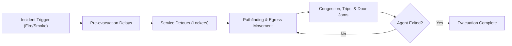

# ComLab V3 Emergency Egress Simulation

Python-powered agent-based micro-simulation for comparing the current ComLab V3 layout against a safer modified layout.

The browser is the visual interface. The simulation logic, agents, pathfinding, incidents, metrics, and comparison run in Python.


## Start Here

```powershell
cd "C:\Users\admin\Documents\Web Projects\simulation_comlabV3"
python run.py
```

Open the dashboard:

```text
http://127.0.0.1:8000
```

Start without automatically opening a browser tab:

```powershell
.\.venv\Scripts\python.exe run.py --no-browser
```

If Python is already on PATH:

```powershell
python run.py
```

## Vercel Deployment

The repository includes a Vercel-compatible structure:

- `public/` contains `index.html`, `app.css`, and `app.js` for the deployed frontend.
- `api/index.py` handles `/api/state`, `/api/control`, `/api/reset`, and `/api/compare`.
- `vercel.json` routes API requests to the Python serverless function and browser routes to `index.html`.

Deploy from the repository root. No build command or output directory is required. If the Vercel dashboard has an Output Directory set, clear it so Vercel serves the root project normally.

## Try It

| What to try | What it shows |
| --- | --- |
| Press **Start** | Runs the live evacuation simulation. |
| Press **Step** | Advances one simulation second for close inspection. |
| Switch **Mode** | Compares current locker placement with the modified layout. |
| Toggle **Panic** | Changes collision, trip, and crowd behavior. |
| Change **Fire** | Moves the incident origin between the data rack, instructor desk, student workstation, television, and assistant bay. |
| Toggle **Heatmap** | Shows accumulated congestion intensity. |
| Click **Run Comparison** | Runs current and modified layouts side by side. |

## What Is Being Simulated

- 36 student agents with immediate, locker-bound, task-bound, and peer-bound behaviors
- 1 instructor, 2 presiding assistants, and 2 custodians
- Current layout with lockers near the Back-Right exit
- Modified layout with lockers moved away from the exit path
- Door collisions, trips/falls, smoke slowdown, crowd density, and congestion heat
- Total evacuation time, active agents, evacuation rate chart, incident log, and side-by-side results
- Average waiting time, average queue length, throughput, exit utilization, and processing time

## Required Presentation Coverage

| Requirement | Evidence in this system |
| --- | --- |
| 1. Project introduction | Title, campus/system background, and study importance are shown in the dashboard and summarized here. |
| 2. Problem definition | The current service/locker zone creates cross-traffic near exit paths, causing door jams and congestion. |
| 3. Objectives | Minimize evacuation/waiting time, reduce queues, improve exit utilization, and compare scenarios. |
| 4. System model and design | Agent-based model with entities, events, resources, queues, state variables, and a process flow diagram. |
| 5. Assumptions/input data | Deterministic seeded timing assumptions stand in for unavailable observed data. |
| 6. Implementation demo | Browser controls expose event stepping, queue heatmap, time progression, scenario changes, and outputs. |
| 7. Results/analysis | The comparison table reports total time, average wait, queue length, throughput, utilization, trips, door hits, and heat. |
| 8. Conclusion/recommendations | The modified layout is evaluated as the recommended improvement when it lowers bottlenecks and incidents. |

### Model Elements

- Entities: 36 students, 1 professor, 2 student assistants, and 2 custodians.
- Events: pack-up delay, movement, pathfinding, locker retrieval, peer waiting, trip/faint, door jam, extinguisher retrieval, and exit.
- Resources: front/back exits, hallway/stair paths, service-bay passage, lockers, fire extinguishers, and staff aides.
- Queues: center-aisle and exit-approach bottlenecks, sampled each second as average queue length.
- State variables: time, agent position, phase, target, wait time, heatmap counts, evacuation rate, trips, door collisions, and completion state.

### Assumptions and Input Data

Actual observed arrival and service data is unavailable, so the model uses deterministic assumptions to keep scenario comparisons repeatable:

| Input | Assumption |
| --- | --- |
| Arrival into motion | Agents begin in the room and activate after behavior-based pack-up delays of 2-12 seconds. |
| Locker service time | 3 seconds in the modified layout; 10-15 seconds in the current layout. |
| Extinguisher retrieval | 4 seconds for the professor after reaching the extinguisher. |
| Trip/faint recovery | 3-18 seconds depending on panic, layout, and assistant proximity. |
| Door jam duration | 3-5 seconds when unmanaged door pressure causes a blockage. |
| Movement constraints | Grid-based one-cell movement with slowdown from smoke, crowd density, narrow rows, and panic. |
| Limitations | Fixed population, fixed floor plan, no continuous physics, and no empirical calibration dataset. |

## Key Files

| File | Purpose |
| --- | --- |
| `run.py` | Main entry point to launch the simulation and web server. |

## Key Files

| File | Purpose |
| --- | --- |
| `run.py` | Main entry point to launch the simulation and web server. |
| `comlab_v3/engine.py` | Core agent-based simulation engine. |
| `comlab_v3/web.py` | Web server providing the user interface. |
| `comlab_v3/static/` | Frontend HTML, CSS, and JavaScript for the UI. |
| `scripts/validate_benchmark.py` | Runs validation and benchmark tests. |
| `tests/test_engine.py` | Unit tests for the simulation engine. |

## Scenario Flow



## Latest Local Validation

Run all validation tests:

```powershell
python -m unittest discover -s tests -v
```

Run the scenario validation and benchmark matrix:

```powershell
python scripts\validate_benchmark.py --iterations 1
```

Recent smoke benchmark on this workspace:

| Metric | Result |
| --- | ---: |
| Scenarios | 20 |
| Total runtime | 28.760789 s |
| Scenarios/sec | 0.70 |
| Simulation steps/sec | 106.22 |

Validated scenario results:

| Layout | Panic | Fire origin | Time | Evacuated | Avg wait | Avg queue | Throughput | Exit util | Trips | Door hits | Max heat |
| --- | --- | --- | ---: | ---: | ---: | ---: | ---: | ---: | ---: | ---: | ---: |
| Current | Yes | Data rack | 180s | 41 / 41 | 92.59s | 14.43 | 13.67/min | 11.39% | 29 | 1 | 778 |
| Current | Yes | Instructor desk | 225s | 41 / 41 | 128.85s | 17.95 | 10.93/min | 9.11% | 29 | 1 | 918 |
| Current | Yes | Student workstation | 238s | 41 / 41 | 123.22s | 16.42 | 10.34/min | 8.61% | 28 | 1 | 1151 |
| Current | Yes | Television | 234s | 41 / 41 | 122.00s | 17.08 | 10.51/min | 8.76% | 22 | 3 | 762 |
| Current | Yes | Assistant bay | 210s | 41 / 41 | 113.12s | 14.71 | 11.71/min | 9.76% | 20 | 1 | 593 |
| Current | No | Data rack | 121s | 41 / 41 | 60.61s | 15.20 | 20.33/min | 16.94% | 13 | 1 | 356 |
| Current | No | Instructor desk | 206s | 41 / 41 | 105.54s | 18.70 | 11.94/min | 9.95% | 13 | 1 | 667 |
| Current | No | Student workstation | 191s | 41 / 41 | 81.29s | 13.61 | 12.88/min | 10.73% | 9 | 1 | 484 |
| Current | No | Television | 157s | 41 / 41 | 92.90s | 19.21 | 15.67/min | 13.06% | 12 | 2 | 512 |
| Current | No | Assistant bay | 163s | 41 / 41 | 71.24s | 11.86 | 15.09/min | 12.58% | 17 | 1 | 390 |
| Modified | Yes | Data rack | 71s | 41 / 41 | 35.59s | 18.55 | 34.65/min | 28.87% | 7 | 2 | 305 |
| Modified | Yes | Instructor desk | 86s | 41 / 41 | 35.05s | 15.03 | 28.60/min | 23.84% | 3 | 0 | 404 |
| Modified | Yes | Student workstation | 112s | 41 / 41 | 48.32s | 16.15 | 21.96/min | 18.30% | 3 | 2 | 466 |
| Modified | Yes | Television | 195s | 41 / 41 | 108.22s | 21.41 | 12.62/min | 10.51% | 5 | 0 | 1448 |
| Modified | Yes | Assistant bay | 124s | 41 / 41 | 58.88s | 18.28 | 19.84/min | 16.53% | 5 | 3 | 576 |
| Modified | No | Data rack | 56s | 41 / 41 | 24.05s | 16.18 | 43.93/min | 36.61% | 2 | 2 | 192 |
| Modified | No | Instructor desk | 92s | 41 / 41 | 36.46s | 15.98 | 26.74/min | 22.28% | 5 | 0 | 242 |
| Modified | No | Student workstation | 58s | 41 / 41 | 26.56s | 17.90 | 42.41/min | 35.34% | 0 | 2 | 363 |
| Modified | No | Television | 262s | 41 / 41 | 144.32s | 20.35 | 9.39/min | 7.82% | 5 | 0 | 2112 |
| Modified | No | Assistant bay | 74s | 41 / 41 | 36.85s | 16.99 | 33.24/min | 27.70% | 3 | 2 | 270 |

<details>
<summary><strong>Project Map</strong></summary>

```text
simulation_comlabV3/
  run.py                         main launcher
  scripts/
    validate_benchmark.py        validation and benchmark matrix
  tests/
    test_engine.py               deterministic engine validation tests
  comlab_v3/
    engine.py                    simulation rules and agent logic
    web.py                       local Python server and API
    static/
      index.html                 app layout
      app.css                    visual design
      app.js                     canvas drawing and controls
```

</details>

<details>
<summary><strong>Local API</strong></summary>

Read current state:

```powershell
Invoke-RestMethod http://127.0.0.1:8000/api/state
```

Step once:

```powershell
Invoke-RestMethod http://127.0.0.1:8000/api/control `
  -Method Post `
  -ContentType "application/json" `
  -Body '{"action":"step"}'
```

Run comparison:

```powershell
Invoke-RestMethod http://127.0.0.1:8000/api/compare -Method Post
```

</details>

<details>
<summary><strong>Where To Change Things</strong></summary>

| File | Change here when you want to... |
| --- | --- |
| `comlab_v3/engine.py` | Adjust evacuation rules, agents, obstacles, speeds, layout constants, pathfinding, incidents, or metrics. |
| `comlab_v3/web.py` | Change API behavior, server host/port, state payloads, or compare behavior. |
| `comlab_v3/static/app.css` | Restyle the dashboard. |
| `comlab_v3/static/app.js` | Change canvas drawing, controls, polling, charts, or comparison rendering. |
| `tests/test_engine.py` | Add deterministic validation cases. |
| `scripts/validate_benchmark.py` | Add benchmark scenarios or change reported metrics. |

</details>

## Model Notes

The engine is deterministic for a fixed scenario. That makes it useful for repeatable validation: when a rule changes, the test suite and benchmark matrix should show exactly how evacuation time, trips, door collisions, and congestion heat changed.
