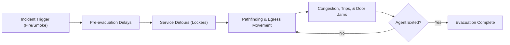

# ComLab V3 Emergency Egress Simulation

Python-powered agent-based micro-simulation for comparing the current ComLab V3 layout against a safer modified layout.

The browser is the visual interface. The simulation logic, agents, pathfinding, incidents, metrics, and comparison run in Python.


## Start Here

```powershell
cd "C:\Users\admin\Documents\Web Projects\simulation_comlabV3"
python run.py
```

Open the dashboard:

```text
http://127.0.0.1:8000
```

Start without automatically opening a browser tab:

```powershell
.\.venv\Scripts\python.exe run.py --no-browser
```

If Python is already on PATH:

```powershell
python run.py
```

## Try It

| What to try | What it shows |
| --- | --- |
| Press **Start** | Runs the live evacuation simulation. |
| Press **Step** | Advances one simulation second for close inspection. |
| Switch **Mode** | Compares current locker placement with the modified layout. |
| Toggle **Panic** | Changes collision, trip, and crowd behavior. |
| Change **Fire** | Moves the incident origin between the data rack and instructor desk. |
| Toggle **Heatmap** | Shows accumulated congestion intensity. |
| Click **Run Comparison** | Runs current and modified layouts side by side. |

## What Is Being Simulated

- 36 student agents with immediate, locker-bound, task-bound, and peer-bound behaviors
- 1 instructor, 2 presiding assistants, and 2 custodians
- Current layout with lockers near the Back-Right exit
- Modified layout with lockers moved away from the exit path
- Door collisions, trips/falls, smoke slowdown, crowd density, and congestion heat
- Total evacuation time, active agents, evacuation rate chart, incident log, and side-by-side results
- Average waiting time, average queue length, throughput, exit utilization, and processing time

## Required Presentation Coverage

| Requirement | Evidence in this system |
| --- | --- |
| 1. Project introduction | Title, campus/system background, and study importance are shown in the dashboard and summarized here. |
| 2. Problem definition | The current service/locker zone creates cross-traffic near exit paths, causing door jams and congestion. |
| 3. Objectives | Minimize evacuation/waiting time, reduce queues, improve exit utilization, and compare scenarios. |
| 4. System model and design | Agent-based model with entities, events, resources, queues, state variables, and a process flow diagram. |
| 5. Assumptions/input data | Deterministic seeded timing assumptions stand in for unavailable observed data. |
| 6. Implementation demo | Browser controls expose event stepping, queue heatmap, time progression, scenario changes, and outputs. |
| 7. Results/analysis | The comparison table reports total time, average wait, queue length, throughput, utilization, trips, door hits, and heat. |
| 8. Conclusion/recommendations | The modified layout is evaluated as the recommended improvement when it lowers bottlenecks and incidents. |

### Model Elements

- Entities: 36 students, 1 professor, 2 student assistants, and 2 custodians.
- Events: pack-up delay, movement, pathfinding, locker retrieval, peer waiting, trip/faint, door jam, extinguisher retrieval, and exit.
- Resources: front/back exits, hallway/stair paths, service-bay passage, lockers, fire extinguishers, and staff aides.
- Queues: center-aisle and exit-approach bottlenecks, sampled each second as average queue length.
- State variables: time, agent position, phase, target, wait time, heatmap counts, evacuation rate, trips, door collisions, and completion state.

### Assumptions and Input Data

Actual observed arrival and service data is unavailable, so the model uses deterministic assumptions to keep scenario comparisons repeatable:

| Input | Assumption |
| --- | --- |
| Arrival into motion | Agents begin in the room and activate after behavior-based pack-up delays of 2-12 seconds. |
| Locker service time | 3 seconds in the modified layout; 10-15 seconds in the current layout. |
| Extinguisher retrieval | 4 seconds for the professor after reaching the extinguisher. |
| Trip/faint recovery | 3-18 seconds depending on panic, layout, and assistant proximity. |
| Door jam duration | 3-5 seconds when unmanaged door pressure causes a blockage. |
| Movement constraints | Grid-based one-cell movement with slowdown from smoke, crowd density, narrow rows, and panic. |
| Limitations | Fixed population, fixed floor plan, no continuous physics, and no empirical calibration dataset. |

## Key Files

| File | Purpose |
| --- | --- |
| `run.py` | Main entry point to launch the simulation and web server. |

## Key Files

| File | Purpose |
| --- | --- |
| `run.py` | Main entry point to launch the simulation and web server. |
| `comlab_v3/engine.py` | Core agent-based simulation engine. |
| `comlab_v3/web.py` | Web server providing the user interface. |
| `comlab_v3/static/` | Frontend HTML, CSS, and JavaScript for the UI. |
| `scripts/validate_benchmark.py` | Runs validation and benchmark tests. |
| `tests/test_engine.py` | Unit tests for the simulation engine. |

## Scenario Flow



## Latest Local Validation

Run all validation tests:

```powershell
python -m unittest discover -s tests -v
```

Run the scenario validation and benchmark matrix:

```powershell
python scripts\validate_benchmark.py --iterations 1
```

Recent smoke benchmark on this workspace:

| Metric | Result |
| --- | ---: |
| Scenarios | 8 |
| Total runtime | 6.401790 s |
| Scenarios/sec | 1.25 |
| Simulation steps/sec | 235.40 |

Validated scenario results:

| Layout | Panic | Fire origin | Time | Evacuated | Avg wait | Avg queue | Throughput | Exit util | Trips | Door hits | Max heat |
| --- | --- | --- | ---: | ---: | ---: | ---: | ---: | ---: | ---: | ---: | ---: |
| Current | Yes | Data rack | 312s | 41 / 41 | 131.49s | 14.12 | 7.88/min | 6.57% | 38 | 16 | 1143 |
| Current | Yes | Instructor desk | 276s | 41 / 41 | 144.54s | 17.44 | 8.91/min | 7.43% | 24 | 8 | 1109 |
| Current | No | Data rack | 216s | 41 / 41 | 83.93s | 13.66 | 11.39/min | 9.49% | 12 | 10 | 780 |
| Current | No | Instructor desk | 233s | 41 / 41 | 95.17s | 13.74 | 10.56/min | 8.80% | 12 | 7 | 670 |
| Modified | Yes | Data rack | 100s | 41 / 41 | 32.95s | 12.07 | 24.60/min | 20.50% | 6 | 13 | 185 |
| Modified | Yes | Instructor desk | 132s | 41 / 41 | 52.29s | 14.55 | 18.64/min | 15.53% | 5 | 12 | 476 |
| Modified | No | Data rack | 124s | 41 / 41 | 40.54s | 11.63 | 19.84/min | 16.53% | 5 | 5 | 269 |
| Modified | No | Instructor desk | 114s | 41 / 41 | 47.44s | 15.90 | 21.58/min | 17.98% | 5 | 5 | 347 |

<details>
<summary><strong>Project Map</strong></summary>

```text
simulation_comlabV3/
  run.py                         main launcher
  scripts/
    validate_benchmark.py        validation and benchmark matrix
  tests/
    test_engine.py               deterministic engine validation tests
  comlab_v3/
    engine.py                    simulation rules and agent logic
    web.py                       local Python server and API
    static/
      index.html                 app layout
      app.css                    visual design
      app.js                     canvas drawing and controls
```

</details>

<details>
<summary><strong>Local API</strong></summary>

Read current state:

```powershell
Invoke-RestMethod http://127.0.0.1:8000/api/state
```

Step once:

```powershell
Invoke-RestMethod http://127.0.0.1:8000/api/control `
  -Method Post `
  -ContentType "application/json" `
  -Body '{"action":"step"}'
```

Run comparison:

```powershell
Invoke-RestMethod http://127.0.0.1:8000/api/compare -Method Post
```

</details>

<details>
<summary><strong>Where To Change Things</strong></summary>

| File | Change here when you want to... |
| --- | --- |
| `comlab_v3/engine.py` | Adjust evacuation rules, agents, obstacles, speeds, layout constants, pathfinding, incidents, or metrics. |
| `comlab_v3/web.py` | Change API behavior, server host/port, state payloads, or compare behavior. |
| `comlab_v3/static/app.css` | Restyle the dashboard. |
| `comlab_v3/static/app.js` | Change canvas drawing, controls, polling, charts, or comparison rendering. |
| `tests/test_engine.py` | Add deterministic validation cases. |
| `scripts/validate_benchmark.py` | Add benchmark scenarios or change reported metrics. |

</details>

## Model Notes

The engine is deterministic for a fixed scenario. That makes it useful for repeatable validation: when a rule changes, the test suite and benchmark matrix should show exactly how evacuation time, trips, door collisions, and congestion heat changed.
