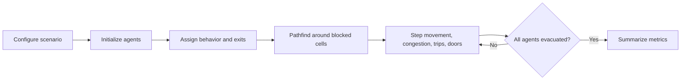

# ComLab V3 Emergency Egress Simulation

Python-powered agent-based micro-simulation for comparing the current ComLab V3 layout against a safer modified layout.

The browser is the visual interface. The simulation logic, agents, pathfinding, incidents, metrics, and comparison run in Python.


## Start Here

```powershell
cd C:\Users\johnm\Documents\ModelandSimulation
.\.venv\Scripts\python.exe run.py
```

Open the dashboard:

```text
http://127.0.0.1:8000
```

Start without automatically opening a browser tab:

```powershell
.\.venv\Scripts\python.exe run.py --no-browser
```

If Python is already on PATH:

```powershell
python run.py
```

## Try It

| What to try | What it shows |
| --- | --- |
| Press **Start** | Runs the live evacuation simulation. |
| Press **Step** | Advances one simulation second for close inspection. |
| Switch **Mode** | Compares current locker placement with the modified layout. |
| Toggle **Panic** | Changes collision, trip, and crowd behavior. |
| Change **Fire** | Moves the incident origin between the data rack and instructor desk. |
| Toggle **Heatmap** | Shows accumulated congestion intensity. |
| Click **Run Comparison** | Runs current and modified layouts side by side. |

## What Is Being Simulated

- 36 student agents with immediate, locker-bound, task-bound, and peer-bound behaviors
- 1 instructor, 2 presiding assistants, and 2 custodians
- Current layout with lockers near the Back-Right exit
- Modified layout with lockers moved away from the exit path
- Door collisions, trips/falls, smoke slowdown, crowd density, and congestion heat
- Total evacuation time, active agents, evacuation rate chart, incident log, and side-by-side results

## Scenario Flow



## Latest Local Validation

Run all validation tests:

```powershell
.\.venv\Scripts\python.exe -m unittest discover -s tests -v
```

Run the scenario validation and benchmark matrix:

```powershell
.\.venv\Scripts\python.exe scripts\validate_benchmark.py --iterations 100
```

Recent benchmark on this workspace:

| Metric | Result |
| --- | ---: |
| Scenarios | 800 |
| Total runtime | 25.911 s |
| Scenarios/sec | 30.87 |
| Simulation steps/sec | 3025.71 |

Validated evacuation times:

| Layout | Panic | Fire origin | Time | Evacuated |
| --- | --- | --- | ---: | ---: |
| Current | Yes | Data rack | 113s | 41 / 41 |
| Current | Yes | Instructor desk | 114s | 41 / 41 |
| Current | No | Data rack | 114s | 41 / 41 |
| Current | No | Instructor desk | 114s | 41 / 41 |
| Modified | Yes | Data rack | 86s | 41 / 41 |
| Modified | Yes | Instructor desk | 81s | 41 / 41 |
| Modified | No | Data rack | 80s | 41 / 41 |
| Modified | No | Instructor desk | 82s | 41 / 41 |

<details>
<summary><strong>Project Map</strong></summary>

```text
ModelandSimulation/
  run.py                         main launcher
  scripts/
    validate_benchmark.py        validation and benchmark matrix
  tests/
    test_engine.py               deterministic engine validation tests
  comlab_v3/
    engine.py                    simulation rules and agent logic
    web.py                       local Python server and API
    static/
      index.html                 app layout
      app.css                    visual design
      app.js                     canvas drawing and controls
```

</details>

<details>
<summary><strong>Local API</strong></summary>

Read current state:

```powershell
Invoke-RestMethod http://127.0.0.1:8000/api/state
```

Step once:

```powershell
Invoke-RestMethod http://127.0.0.1:8000/api/control `
  -Method Post `
  -ContentType "application/json" `
  -Body '{"action":"step"}'
```

Run comparison:

```powershell
Invoke-RestMethod http://127.0.0.1:8000/api/compare -Method Post
```

</details>

<details>
<summary><strong>Where To Change Things</strong></summary>

| File | Change here when you want to... |
| --- | --- |
| `comlab_v3/engine.py` | Adjust evacuation rules, agents, obstacles, speeds, layout constants, pathfinding, incidents, or metrics. |
| `comlab_v3/web.py` | Change API behavior, server host/port, state payloads, or compare behavior. |
| `comlab_v3/static/app.css` | Restyle the dashboard. |
| `comlab_v3/static/app.js` | Change canvas drawing, controls, polling, charts, or comparison rendering. |
| `tests/test_engine.py` | Add deterministic validation cases. |
| `scripts/validate_benchmark.py` | Add benchmark scenarios or change reported metrics. |

</details>

## Model Notes

The engine is deterministic for a fixed scenario. That makes it useful for repeatable validation: when a rule changes, the test suite and benchmark matrix should show exactly how evacuation time, trips, door collisions, and congestion heat changed.
